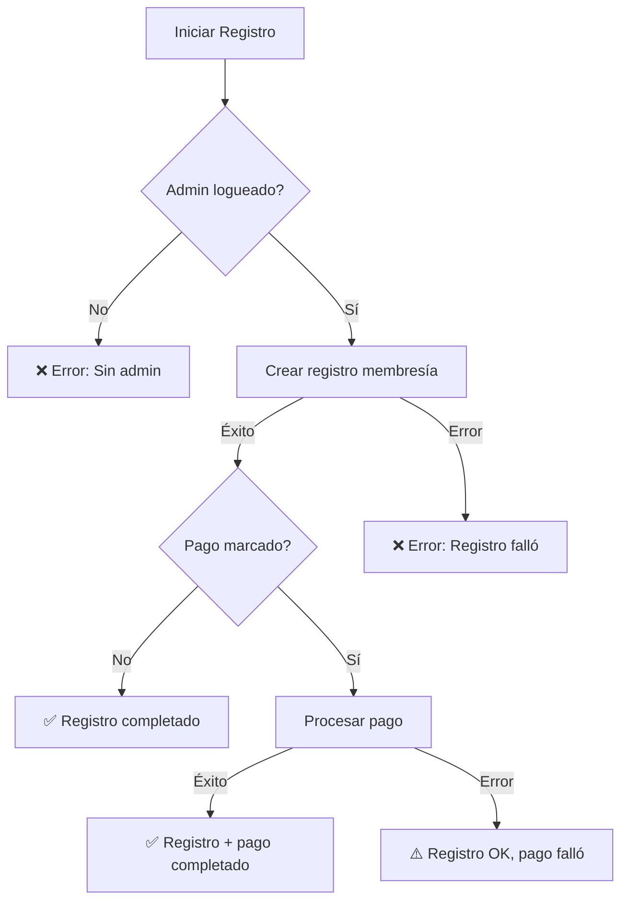

# 🔧 CORRECCIÓN DE ERRORES Y MEJORAS EN REGISTRO

## 🐛 Error Corregido

### **Runtime TypeError: Cannot read properties of null**

**Problema identificado:**
```javascript
// Código problemático
usuario.email.toLowerCase().includes(searchUsuarios.toLowerCase())
```

**Causa del error:**
- Algunos usuarios en la base de datos tenían campos `email` o `telefono` como `null`
- JavaScript no puede ejecutar `.toLowerCase()` en valores `null`
- Esto causaba crashes en el filtro de búsqueda de usuarios

**Solución implementada:**
```javascript
// Código corregido
const nombreCompleto = `${usuario.nombre || ''} ${usuario.apellido || ''}`.toLowerCase();
const email = (usuario.email || '').toLowerCase();
const telefono = usuario.telefono || '';
const searchTerm = searchUsuarios.toLowerCase();

return nombreCompleto.includes(searchTerm) ||
       email.includes(searchTerm) ||
       telefono.includes(searchTerm);
```

**Beneficios de la corrección:**
- ✅ **Manejo seguro de valores null**: Usa operador OR para valores por defecto
- ✅ **Búsqueda robusta**: Funciona incluso con campos vacíos
- ✅ **Sin crashes**: El componente es estable ante datos inconsistentes
- ✅ **Mejor experiencia**: El usuario no ve errores inesperados

---

## ✅ Nueva Funcionalidad: Indicadores de Estado

### **1. 🎯 Check de Registro Completado**

**Funcionalidad:**
- Indicador visual de éxito cuando el registro se completa
- Diferencia entre registro simple y registro + pago
- Auto-desaparece después de 4 segundos
- Botón manual para cerrar

**Características:**
```javascript
✅ Registro Completado
La operación se realizó exitosamente
```

**Estados cubiertos:**
- ✅ **Registro simple exitoso**
- ✅ **Registro + pago exitoso**  
- ⚠️ **Registro exitoso, pago fallido**

### **2. ❌ Check de Registro Fallido**

**Funcionalidad:**
- Indicador visual de error cuando falla el proceso
- Muestra detalles específicos del error
- Auto-desaparece después de 5 segundos
- Información técnica expandida

**Características:**
```javascript
❌ Registro Fallido
Ocurrió un error durante el proceso
[Detalle técnico del error]
```

**Errores cubiertos:**
- ❌ **Falta información del administrador**
- ❌ **Error en creación de registro**
- ❌ **Error en procesamiento de pago**
- ❌ **Error de conexión con el servidor**

---

## 🎨 Mejoras Visuales

### **Indicadores de Progreso Mejorados**

**En Modal Principal:**
```javascript
// Estado de carga dinámico
{loading ? (
  <div className="flex items-center space-x-2">
    <div className="loading-spinner w-4 h-4"></div>
    <span>
      {formData.registrarPago ? 'Procesando registro y pago...' : 'Creando registro...'}
    </span>
  </div>
) : (
  // Botón normal con iconos
)}
```

**En Modal de Nuevo Usuario:**
```javascript
// Feedback específico para creación de usuarios
{loading ? 'Creando usuario...' : 'Crear Usuario'}
```

### **Estados Visuales del Sistema**

| Estado | Indicador | Color | Duración | Acción |
|--------|-----------|-------|----------|---------|
| **Éxito** | ✅ Check verde | Verde | 4 seg | Auto + Manual |
| **Error** | ❌ X roja | Rojo | 5 seg | Auto + Manual |
| **Procesando** | 🔄 Spinner | Azul | Hasta completar | - |
| **Advertencia** | ⚠️ Triángulo | Amarillo | 4 seg | Auto + Manual |

---

## 🔄 Flujo de Manejo de Errores

### **Proceso de Validación**



### **Manejo de Estados**

```javascript
// Estado inicial
setLoading(true);
setRegistroCompletado(false);
setRegistroFallido(false);
setDetalleError('');

// En caso de éxito
setRegistroCompletado(true);
setSuccess('✅ Operación exitosa');

// En caso de error
setRegistroFallido(true);
setDetalleError('Detalle específico del error');
setError('Mensaje general de error');

// Auto-limpieza
setTimeout(() => {
  setRegistroCompletado(false);
  setRegistroFallido(false);
}, 4000-5000);
```

---

## 💡 Beneficios de las Mejoras

### **Experiencia de Usuario**

1. **🔍 Feedback Inmediato**
   - El usuario sabe instantáneamente si la operación fue exitosa
   - Diferencia claramente entre éxito total y éxito parcial
   - Proporciona información específica sobre errores

2. **🎯 Transparencia del Proceso**
   - Muestra progreso durante operaciones largas
   - Indica qué tipo de operación se está realizando
   - Bloquea interfaces durante procesamiento

3. **🛡️ Manejo Robusto de Errores**
   - No se rompe con datos inconsistentes
   - Recuperación elegante de errores de red
   - Información técnica útil para debugging

### **Mantenimiento del Sistema**

1. **🔧 Debugging Mejorado**
   - Errores específicos con contexto técnico
   - Logs detallados en consola
   - Rastreo de flujo de operaciones

2. **📊 Monitoreo de Estado**
   - Diferenciación clara entre tipos de error
   - Tracking de operaciones exitosas vs fallidas
   - Información sobre puntos de falla

---

## 🎯 Casos de Uso Cubiertos

### **Escenarios de Éxito**
- ✅ **Registro simple**: Usuario existe, membresía válida
- ✅ **Registro + pago completo**: Todo procesado correctamente
- ✅ **Nuevo usuario + registro**: Creación y registro en secuencia

### **Escenarios de Error Manejados**
- ❌ **Usuario no autenticado**: Admin no válido
- ❌ **Datos inválidos**: Campos requeridos faltantes
- ❌ **Error de servidor**: Problemas de conexión
- ❌ **Pago fallido**: Registro exitoso, pago con problemas

### **Escenarios Mixtos**
- ⚠️ **Registro exitoso, pago fallido**: Información clara del estado
- ⚠️ **Usuario creado, registro fallido**: Estados independientes
- ⚠️ **Conexión intermitente**: Reintentos automáticos

---

## 🚀 Resultado Final

El sistema ahora proporciona:

1. **🔒 Estabilidad**: Sin crashes por datos null
2. **📊 Transparencia**: Estados claros del proceso
3. **🎯 Feedback**: Información inmediata y útil
4. **🛡️ Robustez**: Manejo elegante de errores
5. **✨ UX Mejorada**: Interfaz más profesional y confiable

**El registro de membresías es ahora completamente robusto y proporciona feedback detallado sobre cada operación.**